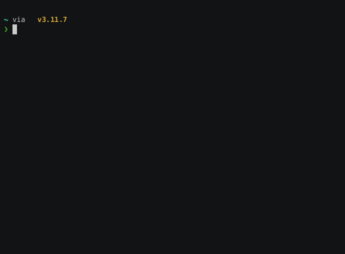

# tonie-podcast-sync
<!-- ALL-CONTRIBUTORS-BADGE:START - Do not remove or modify this section -->
[](#contributors-)
<!-- ALL-CONTRIBUTORS-BADGE:END -->

tonie-podcast-sync allows synching podcast episodes to [creative tonies](https://tonies.com).

📖 **[Read the full documentation](https://alexhartm.github.io/tonie-podcast-sync/)**

This is a purely private project and has no association with Boxine GmbH.

[](https://asciinema.org/a/644812 "asciicast Recording of tonie-podcast-sync")


# Prerequisites

- requires Python >= 3.10.11
- if you use the `volume_adjustment` feature for a Podcast, `ffmpeg` needs to be installed

# Usage

tonie-podcast-sync is available as [a pip package on pypi](https://pypi.org/project/tonie-podcast-sync). Install via

`pip install tonie-podcast-sync`

You then have two options of using this: via its CLI or as a python library.

## via CLI

The most convienent way is to just use the CLI:


A first step is to configure `tonie-podcast-sync`

```bash
tonie-podcast-sync create-settings-file
```

The command will guide you through the process. The settings and optionally also a secret file will be stored in `~/.toniepodcastsync`.

Afterwards, you can run

```bash
tonie-podcast-sync list-tonies
```
to get an overview about your tonies, and

```bash
tonie-podcast-sync update-tonies
```

to fetch new podcast episodes and download them onto the tonies and

If you want to perform changes (e.g. switch to another podcast), you can edit the settings file `~/.toniepodcastsync/settings.toml` in a text editor.

### CLI Settings File Format

The settings file supports the following options for each creative tonie:

```toml
[creative_tonies.<tonie-id>]
podcast = "https://example.com/podcast.xml"
name = "My Tonie Name"
episode_sorting = "by_date_newest_first"  # or "by_date_oldest_first", "random"
maximum_length = 90  # Maximum duration in minutes
episode_min_duration_sec = 0  # Minimum episode duration in seconds (optional, defaults to 0)
episode_max_duration_sec = 5400  # Maximum total duration of epsiodes on this tonie in seconds (optional, defaults to what the tonie can store at maximum)
volume_adjustment = 0  # volume adjustment in dB (+/-)
excluded_title_strings = ["vampir", "brokkoli"]  # filter out scary episodes
```

The `excluded_title_strings` field is optional and allows you to filter out episodes whose titles contain any of the specified strings (case-insensitive matching).

The `episode_max_duration_sec` field is optional. It filters out individual episodes that exceed this duration. Note that this is different from `maximum_length`, which controls the total duration of episodes placed on the tonie.

To periodically fetch for new episodes, you can schedule `tonie-podcast-sync` e.g. via systemd (on a Linux OS).

In addition,

```bash
tonie-podcast-sync --help
```

provides an overview about these and other available commands.


## in your own Python scripts

You can use `tonie-podcast-sync` by importing it into your own Python scripts, as in this example code:

```python
from tonie_podcast_sync.toniepodcastsync import ToniePodcastSync, Podcast, EpisodeSorting

# Create some Podcast objects, providing the feed URL to each
pumuckl = Podcast("https://feeds.br.de/pumuckl/feed.xml")

# By default, podcasts are placed onto Tonies by newest episode first
# If you want to change the episode sorting, following options are available
# - EpisodeSorting.BY_DATE_NEWEST_FIRST (default)
# - EpisodeSorting.BY_DATE_OLDEST_FIRST
# - EpisodeSorting.RADNOM
maus_60min = Podcast(
    "https://kinder.wdr.de/radio/diemaus/audio/diemaus-60/diemaus-60-106.podcast",
    episode_sorting = EpisodeSorting.BY_DATE_NEWEST_FIRST
)
maus_gute_nacht = Podcast(
    "https://kinder.wdr.de/radio/diemaus/audio/gute-nacht-mit-der-maus/diemaus-gute-nacht-104.podcast",
    episode_sorting = EpisodeSorting.RANDOM
)

# If you want to adjust the volume of a podcast, set volume_adjustment to an integer other than 0
# The audio will be adjusted (+/-) by that amount in dB
anne_und_die_wilden_tiere = Podcast(
    "https://feeds.br.de/anna-und-die-wilden-tiere/feed.xml",
    episode_sorting = EpisodeSorting.RANDOM,
    volume_adjustment = -2
)

# Some Podcasts inject episodes that are very short (e.g. announcing a holiday break).
# `episode_min_duration_sec` can be used to filter out all episodes shorter then this value.
# the example below will skip all episodes shorter then 30 seconds.
checker_tobi = Podcast(
    "https://feeds.br.de/checkpod-der-podcast-mit-checker-tobi/feed.xml",
    episode_sorting = EpisodeSorting.RANDOM,
    episode_min_duration_sec = 30
)

# You can also filter out episodes by title strings. Episodes with titles containing
# any of the specified strings (case-insensitive) will be excluded.
# This is useful for filtering out episodes that are too scary (for example).
maus_filtered = Podcast(
    "https://kinder.wdr.de/radio/diemaus/audio/maus-gute-nacht/maus-gute-nacht-148.podcast",
    excluded_title_strings = ["vampir", "brokkoli"]
)

# Create instance of ToniePodcastSync
tps = ToniePodcastSync("<toniecloud-username>", "<toniecloud-password>")

# For an overview of your creative Tonies and their IDs
# The IDs are needed to address specific Tonies in the next step
tps.print_tonies_overview()

# Define creative Tonies based on their ID
greenTonie = "<your-tonieID>"
orangeTonie = "<your-tonieID>"
greyTonie = "<your-tonieID>"

# Fetch new podcast episodes and copy them to greenTonie.
# The tonie will be filled with as much episodes as fit (90 min max).
tps.sync_podcast_to_tonie(pumuckl, greenTonie)

# Kid's should fall asleep, so let's limit the podcast
# Episodes on this tonie to 60 minutes in total.
# Use the optional parameter for this:
tps.sync_podcast_to_tonie(maus_gute_nacht, orangeTonie, 60)

# By default, syncing a podcast to a tonie will remove all
# existing content on that tonie:
tps.sync_podcast_to_tonie(checker_tobi, greyTonie, 30)
# If you want to add episodes without deleting existing content
# on the tonie, use the wipe=False parameter:
tps.sync_podcast_to_tonie(checker_tobi, greyTonie, 30, wipe=False)
```

For the tonie to fetch new content from tonie-cloud, you have to press one ear for 3s (until the "ping" sound) with no tonie on the box (refer also to TonieBox manual).

## as a docker container

@goldbricklemon has created a docker container around this: [docker-tonie-podcast-sync](https://github.com/goldbricklemon/docker-tonie-podcast-sync).

# Contributors

<!-- ALL-CONTRIBUTORS-LIST:START - Do not remove or modify this section -->
<!-- prettier-ignore-start -->
<!-- markdownlint-disable -->
<table>
  <tbody>
    <tr>
      <td align="center" valign="top" width="14.28%"><a href="https://github.com/alexhartm"><br /><sub><b>Alexander Hartmann</b></sub></a><br /><a href="https://github.com/alexhartm/tonie-podcast-sync/commits?author=alexhartm" title="Code">💻</a> <a href="#ideas-alexhartm" title="Ideas, Planning, & Feedback">🤔</a> <a href="#maintenance-alexhartm" title="Maintenance">🚧</a></td>
      <td align="center" valign="top" width="14.28%"><a href="https://github.com/Wilhelmsson177"><br /><sub><b>Wilhelmsson177</b></sub></a><br /><a href="https://github.com/alexhartm/tonie-podcast-sync/commits?author=Wilhelmsson177" title="Code">💻</a> <a href="#ideas-Wilhelmsson177" title="Ideas, Planning, & Feedback">🤔</a> <a href="#maintenance-Wilhelmsson177" title="Maintenance">🚧</a> <a href="https://github.com/alexhartm/tonie-podcast-sync/commits?author=Wilhelmsson177" title="Tests">⚠️</a></td>
      <td align="center" valign="top" width="14.28%"><a href="https://cv.maltebaer.vercel.app/"><br /><sub><b>Malte Bär</b></sub></a><br /><a href="https://github.com/alexhartm/tonie-podcast-sync/issues?q=author%3Amaltebaer" title="Bug reports">🐛</a></td>
      <td align="center" valign="top" width="14.28%"><a href="https://github.com/einvalentin"><br /><sub><b>Valentin v. Seggern</b></sub></a><br /><a href="https://github.com/alexhartm/tonie-podcast-sync/commits?author=einvalentin" title="Code">💻</a></td>
      <td align="center" valign="top" width="14.28%"><a href="https://github.com/stefan14808"><br /><sub><b>stefan14808</b></sub></a><br /><a href="https://github.com/alexhartm/tonie-podcast-sync/commits?author=stefan14808" title="Code">💻</a> <a href="#ideas-stefan14808" title="Ideas, Planning, & Feedback">🤔</a></td>
      <td align="center" valign="top" width="14.28%"><a href="https://github.com/goldbricklemon"><br /><sub><b>GoldBrickLemon</b></sub></a><br /><a href="https://github.com/alexhartm/tonie-podcast-sync/issues?q=author%3Agoldbricklemon" title="Bug reports">🐛</a> <a href="https://github.com/alexhartm/tonie-podcast-sync/commits?author=goldbricklemon" title="Code">💻</a></td>
    </tr>
  </tbody>
</table>

<!-- markdownlint-restore -->
<!-- prettier-ignore-end -->

<!-- ALL-CONTRIBUTORS-LIST:END -->

> Use the [all-contributors github bot](https://allcontributors.org/docs/en/bot/usage) to add contributors here.

## builds upon work of / kudos to
- moritj29's awesome [tonie_api](https://github.com/moritzj29/tonie_api)
- [Tobias Raabe](https://tobiasraabe.github.io/blog/how-to-download-files-with-python.html)
- [Matthew Wimberly](https://codeburst.io/building-an-rss-feed-scraper-with-python-73715ca06e1f)
